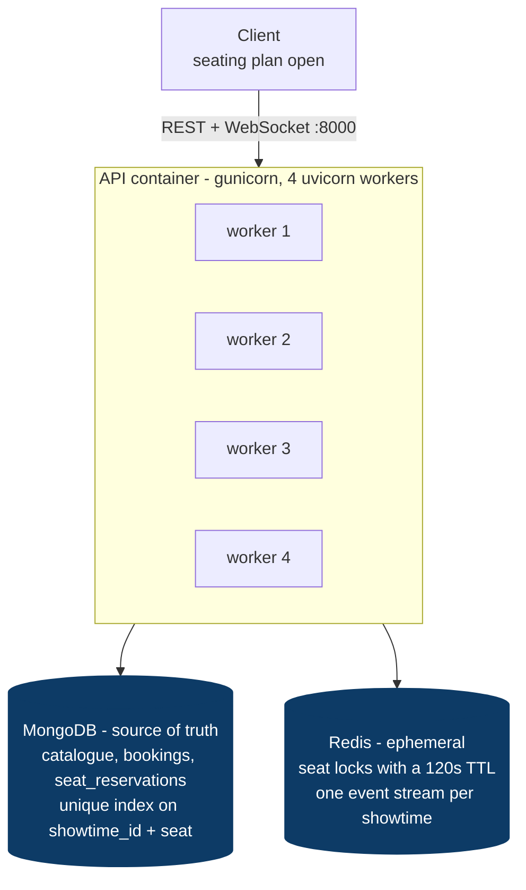
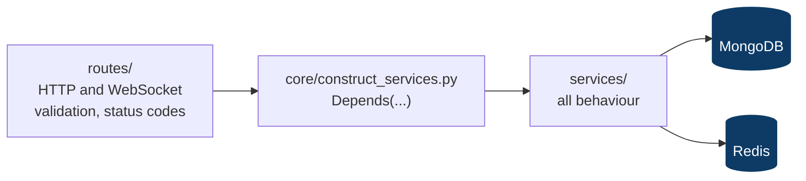
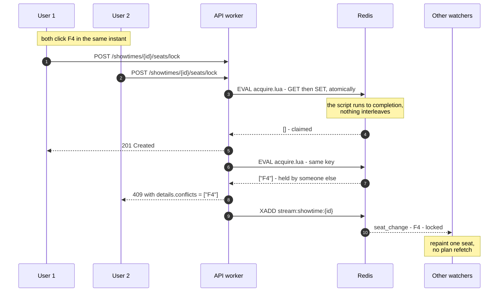
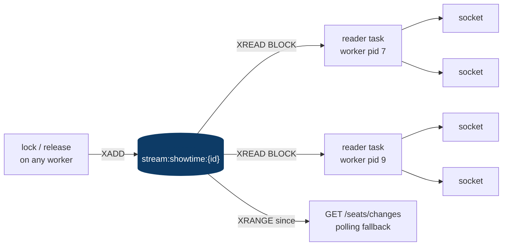
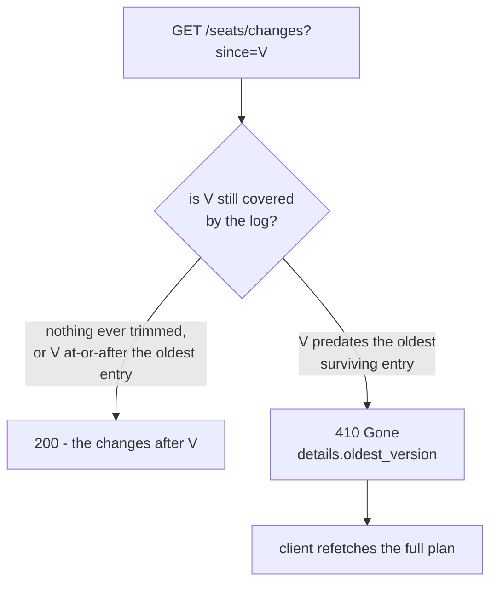
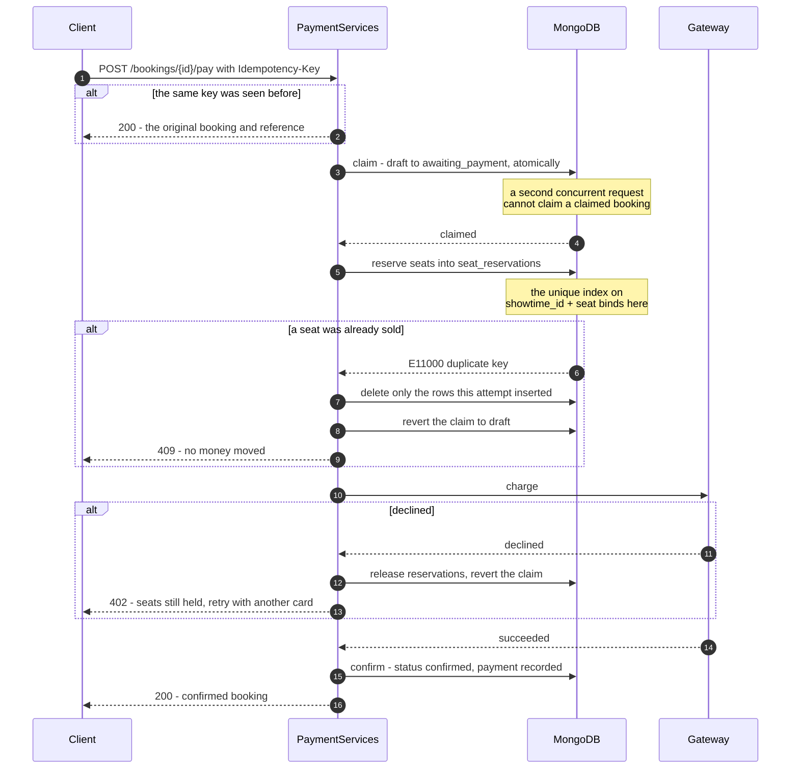
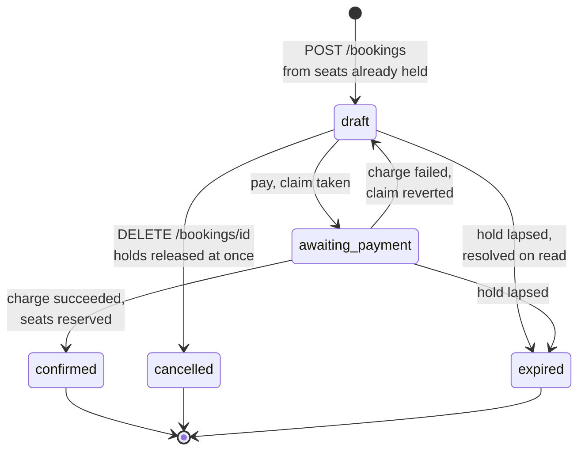

# Architecture

Diagrams for the Cinema Booking API. Written in Mermaid, so GitHub renders them
inline and they stay editable in review — no image to regenerate when the design
moves.

The whole system exists to answer one requirement from the brief:

> As User 2 starts booking seat A3, User 1 sees A3 as locked and can no longer
> book it.

Everything below is arranged around how that is achieved and why it holds.

**Contents** — [System at a glance](#system-at-a-glance) · [Request path](#request-path) · [Seat locking](#seat-locking-the-race) · [Real-time fan-out](#real-time-fan-out) · [Payment](#payment-ordering-by-reversibility) · [Booking lifecycle](#booking-lifecycle) · [Where state lives](#where-state-lives)

---

## System at a glance

Two datastores with sharply different jobs. That split is the central decision:
**losing a lock costs a user a retry; losing a reservation would sell the same
seat twice.** Only the second needs durability.



Any worker serves any request. Nothing is held in a worker between requests —
no session store, no sticky routing — so the service scales by adding workers or
containers, with nothing to drain on deploy.

---

## Request path

The layering is the base template's, kept deliberately: a route resolves its
service through one dependency module, and only services touch a datastore.



---

## Seat locking: the race

The headline guarantee. **Redis runs a Lua script to completion before any other
command touches the keyspace**, so checking every requested seat and then
claiming them is one indivisible step. Two users racing cannot both see F4 free.



Three properties fall out of that single fact, and a fourth from the script
acquiring nothing at all:

| Property | Why the script gives it |
| --- | --- |
| Nothing interleaves | Check-then-claim is indivisible |
| All or nothing | F4 and F5 are taken together or not at all — no half selection to roll back |
| Holder only | Compare-and-delete is inside the script, so User 2 cannot free User 1's seat |
| **Cannot deadlock** | The script waits on nothing, so `{F4,F5}` against `{F5,F4}` is a non-event. Row locking in a relational store would deadlock on exactly that |

**The TTL is what makes an abandoned tab harmless.** Close the browser and the
seats free themselves in 120 seconds. No sweeper job, no expiry table, nothing
scheduled anywhere in the system.

---

## Real-time fan-out

**One Redis reader per worker per showtime — not one per client.** The naive
design gives every socket its own blocking read: 300 people watching one
screening would mean 300 Redis connections.



Redis connections scale with **screenings being watched**, not with viewers.

Both transports read the same log, which is the point: a WebSocket client and a
polling client cannot end up disagreeing, because there is only one record of
what happened. A stream rather than pub/sub, because pub/sub is fire-and-forget
— a dropped subscriber has no way to learn what it missed, and the polling
endpoint could not be built on it at all.

**Verified across processes:** with the socket held by worker `pid 9` and eight
locks handled by workers `pid 10` and `pid 7` — none by `pid 9` — the socket
still received all eight changes. Delivery goes through Redis, not process
memory.

### When a catch-up cannot be completed

The log is trimmed at 1,000 entries per screening. A client away long enough
loses its place, and returning whichever entries survived would leave it
believing it had caught up while silently missing the rest.



Sitting *exactly* on the oldest surviving entry is still served — everything
after it is intact by definition — so the check costs nothing in the normal case.

---

## Payment: ordering by reversibility

The order of operations is the design, not an implementation detail. Each step
is cheaper to undo than the one after it, so **the irreversible step goes last,
when everything that could still fail already has.**



**Reserving before charging** means a seat lost between the summary screen and
the payment screen costs the user nothing: the request fails with `409` before
any money moves. Charging first would mean taking payment for seats that were
never allocated, which needs a refund to undo.

---

## Booking lifecycle

Note what `awaiting_payment` actually is: **not "the user is on the payment
screen", but "a payment is in flight"**. It is the atomic claim that stops two
concurrent payments for one booking, and it reverts to `draft` if the charge
fails.



**Expiry is resolved when a booking is read**, not by a scheduled job. The seats
are already free by then — the Redis TTL did that — so this only brings the
booking's *status* into line, and nothing runs in the background.

---

## Where state lives

The table that explains every other decision here.

| | MongoDB | Redis |
| --- | --- | --- |
| **Holds** | Catalogue, bookings, seat reservations | Seat locks, event stream |
| **Lifetime** | Permanent | 120s selection, 600s checkout, 1,000-entry log |
| **Authority** | **Yes** — the unique `(showtime_id, seat)` index | No |
| **If it is lost** | The same seat could be sold twice | A user retries their selection |
| **Cleanup** | None needed | None — keys TTL away by themselves |

Redis stops two users reaching checkout for the same seat. It is **not** trusted
for the final booking, because a lock can be lost to a restart or an eviction.
The binding guarantee is the unique index, applied when payment is confirmed:

```
insert a second reservation for a sold seat
  -> E11000 duplicate key error (uniq_showtime_seat)

the same seat on a different showtime
  -> accepted, so the constraint is scoped to the screening
```

---

Prose versions of all of this, with the reasoning and the alternatives that were
rejected, are in [backend/README.md](../backend/README.md).
